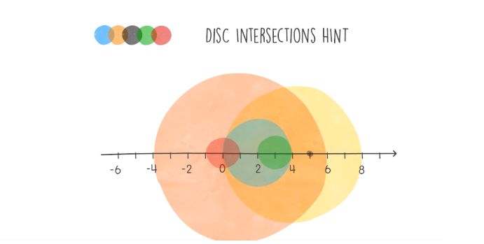
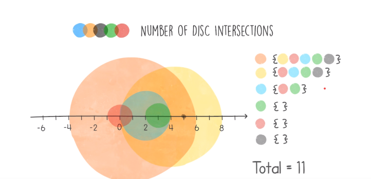
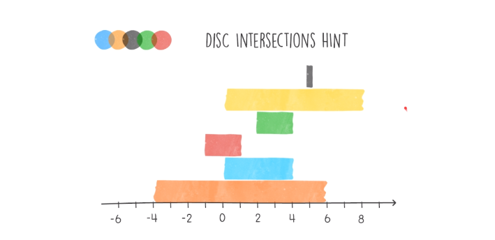
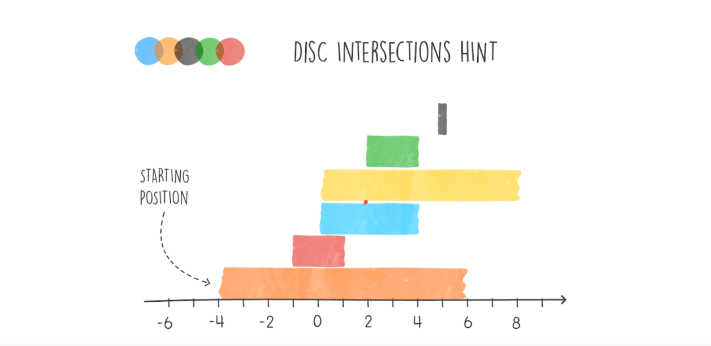
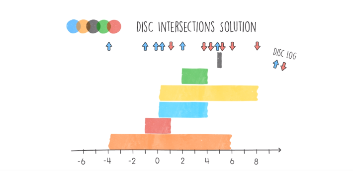
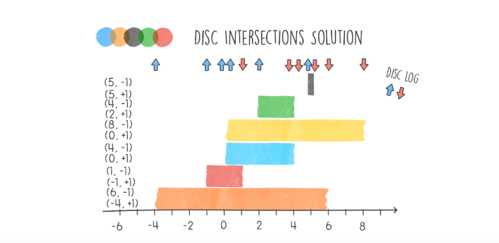
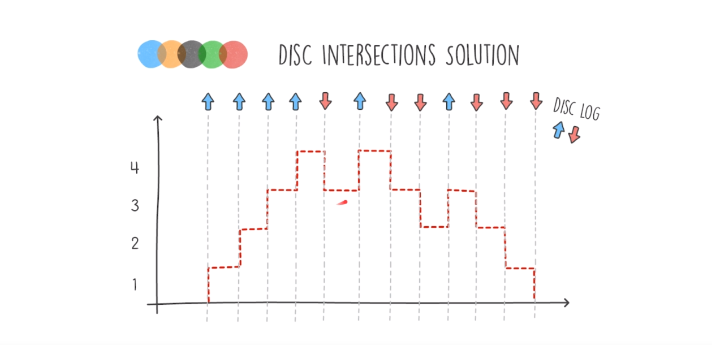
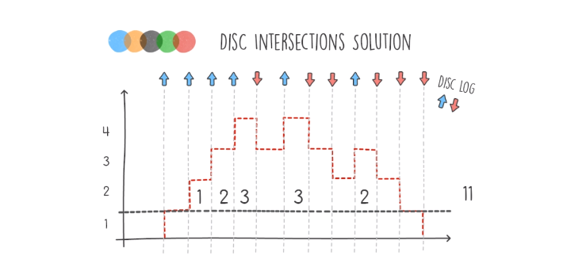

# Perm Missing Element Problem

## Definition
- We have several discs that lie on the same X-axis, having different centers and radius.
- We should return the pairs of intersections, distinct pairs.
- The input is a list of integers representing the radius of the discs, while the index represents the position of the center.
- Our target is to find a solution with log-linear time complexity O(nlog(n)) and linear space complexity O(n).
    <table>
        <tr>
            <td></td>
            <td></td>
        </tr>
    </table>

## Hints
- Look at the problem from a different angle, from the top we can see subarrays that are intersecting.
- Using sorting attributes will help to solve the problem (binary search).
- For example, sort the discs (subarrays) by their starting position.
    <table>
        <tr>
            <td></td>
        </tr>
    </table>

## Solution
- Create at every start and end of a disc, create an event log.
- Blue arrows for the starts and red arrows for the ends.
- Construct the log of events of each disc by generating a list of two types of tuples:
    - tuples having the first element is the index of the start of the disc and the second is +1 indicating that this is a start arrow.
    - tuples having the first element is the index of the end of the disc and the second is -1 indicating that this is an end arrow.
- Sort the tuples by their first element, and if the first elements of two tuples are equal, sort by their second element.
- After sorting throw away the first element and keep the +1 and -1 values.
- From this list of values, build a chart from left to right by adding them up together.
- This chart will tell us how many discs are overlapping each other:
    - Processing from left to right, each start arrow (or value +1) indicates an intersection.
    - The number of overlapped discs (intersections) is the value on Y-axis -1.
    <table>
        <tr>
            <td></td>
            <td></td>
            <td></td>
        </tr>
    </table>
    <table>
        <tr>
            <td width="200"></td>
            <td></td>
            <td></td>
            <td width="200"></td>
        </tr>
    </table>

## Code
    class DiscLog():
        def __init__(self, x, start_end):
            self.x = x
            self.start_end = start_end

    def solution(input):
        disc_history = []
        for i in range(len(input)):
            # NOTE getting the start position is the center position (index) - radius (value)
            disc_history.append(DiscLog(i - input[i], 1))
            # NOTE getting the end position is the center position (index) + radius (value)
            disc_history.append(DiscLog(i + input[i], -1))
        # NOTE sort in asc by x position, then by start end indicator
        disc_history.sort(key=lambda d: (d.x, -d.start_end))
        
        intersections = 0
        active_intersections = 0

        for log in disc_history:
            active_intersections += log.start_end
            if log.start_end > 0:
                # NOTE The number of overlapped discs (intersections) is the value on Y axis -1
                intersections += active_intersections -1

        return intersections