# Max Profit Problem

## Definition
- ### Recap
    - One of the famous subarrays problems, is the max subarray in a list.
    - First, we used to go over every element in the list and calculate the sum starting from it, we will have an algorithm having quadratic runtime complexity.
    - Other solutions like split the list into 2 parts will result from an algorithm having log-linear runtime complexity.
    - Then we have the **Kadane algorithm** having a linear runtime complexity, that calculates the max subarray.
- In this problem, we have input the daily prices of a particular stock.
- We need to find the best times we can purchase and sell, to gain max profit.
- Our target is to find a solution with linear time complexity O(n) and constant space complexity O(1).

## Hints
- We should take a look at the Kadane algorithm.

## Solution
- We use in this subarray 2 variables, **global_max** and **local_max**.
- the initial values of these variables is the first element in the input list.
- Moving forward, we add each element we reach to the local_max and we compare the result with the local_max and we take the bigger one.
    - If the sum is the bigger result, we expand the local_max subarray.
    - If the reached element is bigger than the sum, we reset the local_max variable the value of that element.
- Once the value of the local_max is equal to or bigger than the global_max, we set the local_max as the global_max value.
- Once we process all the elements of the list, the result will be the global_max variable.
- What to Do if we had an input list containing only positive numbers? the Kadane algorithm will return the whole list as max subarray.
    - We calculate the delta => the difference of two adjacents elements
    - We start by the second element and we subtract from it the first element, and we do the same for all other elements.
    <table>
        <tr>
            <td>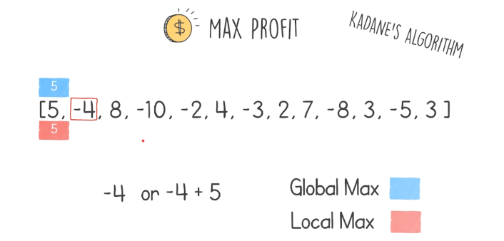</td>
            <td>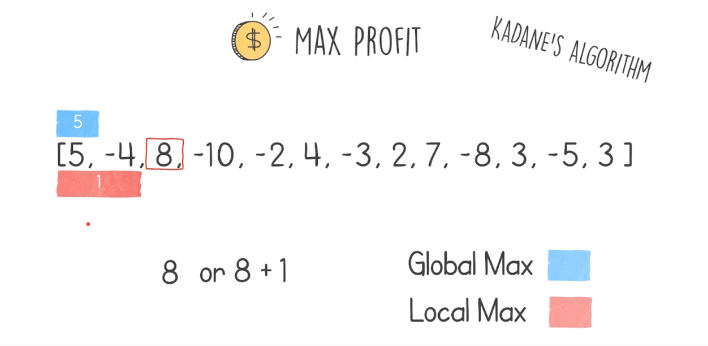</td>
            <td>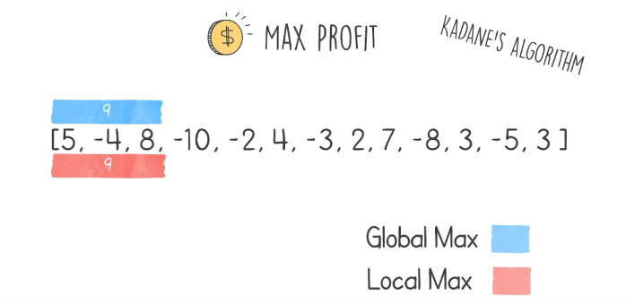</td>
        </tr>
        <tr>
            <td>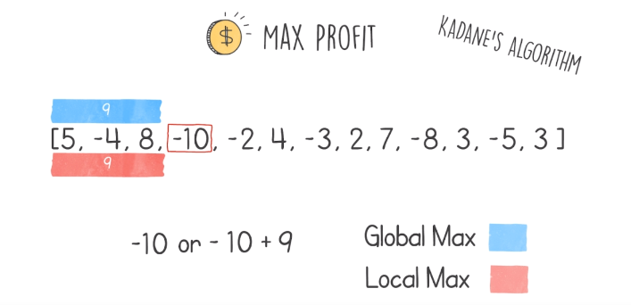</td>
            <td>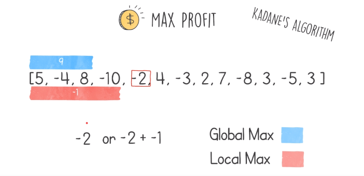</td>
            <td>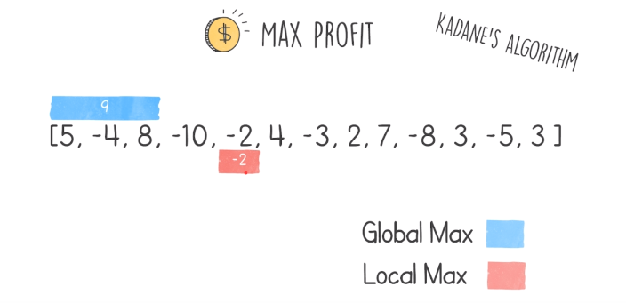</td>
        </tr>
        <tr>
            <td>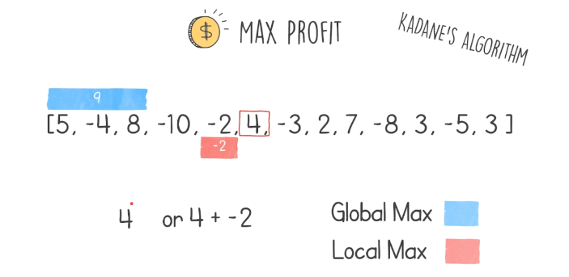</td>
            <td>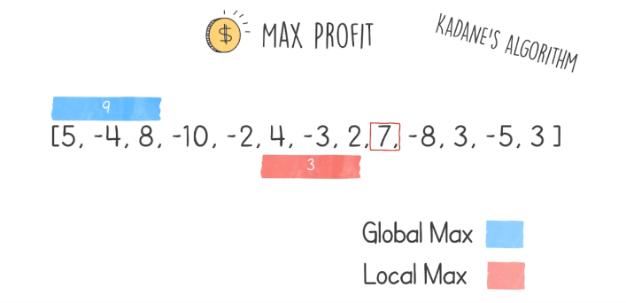</td>
            <td>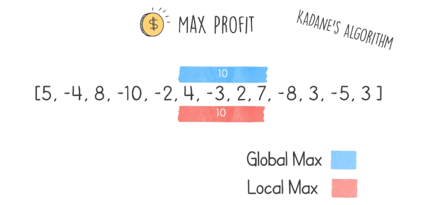</td>
        </tr>
        <tr>
            <td>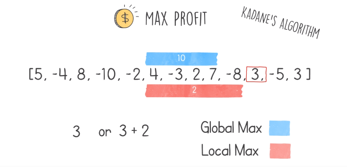</td>
            <td>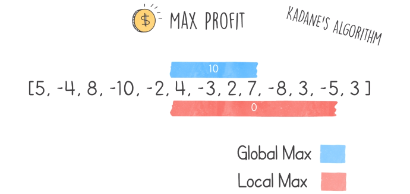</td>
            <td>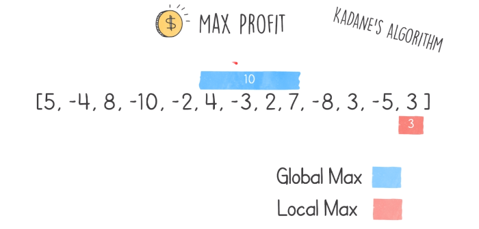</td>
        </tr>
    </table>

## Code
    def solution(input):
        global_max_sum = 0
        local_max_sum = 0
        for i in range(1, len(input)):
            delta = input[i] - input[i-1]
            local_max_sum = max(delta, local_max_sum + delta)
            global_max_sum = max(local_max_sum, global_max_sum)

        return global_max_sum