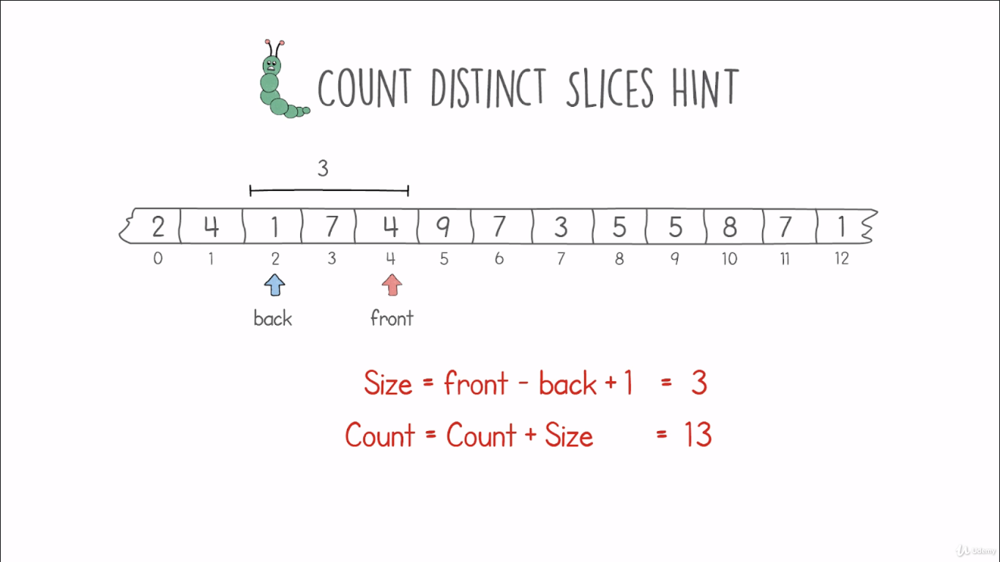
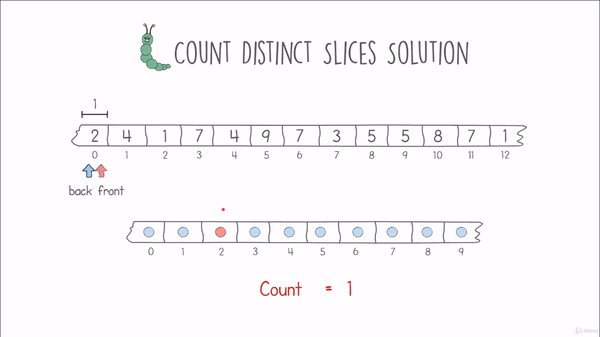

# Count Distinct Slices Problem

## Definition
- We are given an input of numbers, we need to find the total number of distinct slices of this element.
- A distinct slice is a portion of this input where none of their elements are unique.
- Example of distinct slices
    <table>
        <tr>
            <td></td>
            <td></td>
            <td></td>
            <td></td>
        </tr>
    </table>
- Our target is to find a solution with linear time complexity O(n) and linear space complexity O(m).

## Hints
- Use the front and the back pointers (caterpillar method)
- The steps of this method are:
    - Moving pointers
    - Finding Duplicates
    - Counting Distinct Slices
- Moving the front pointer, we will have a sliding window. If there are no duplicates, the count of distinct slices increment by the size of the sliding window array.
    - starting from one element --> count = 1
    - add one distinct element --> count = 1 + new size [2] = 3
    - add one distinct element --> count = 3 + 3 = 6
    - add one distinct element --> count = 6 + 4 = 10
    - ...
- When we encounter a duplicate value, we enter the duplicate mode, which means time to increment the back pointer.
    - Keep moving the back pointer forward until the duplication is gone.
    <table>
        <tr>
            <td></td>
            <td></td>
            <td></td>
        </tr>
        <tr>
            <td></td>
            <td></td>
            <td></td>
        </tr>
    </table>
- But to detect that we have duplicates in our window?

## Solution
- We create an array of size m + 1 (max number of our input)
- Each number we encounter we set a flag that this number is in our current window.
- When we encounter a duplicate value, we enter the duplicate mode by moving the back pointer forward.
- Each value encountered by the back pointer, we unmark this value in the new array.
- Keep moving the back pointer forward until we unmark the duplicate value.
- Keep moving forward until the front pointer reach the last element and the sliding window is unique.
    <table>
        <tr>
            <td></td>
            <td></td>
        </tr>
        <tr>
            <td></td>
            <td></td>
        </tr>
        <tr>
            <td></td>
            <td></td>
        </tr>
        <tr>
            <td></td>
            <td></td>
        </tr>
        <tr>
            <td></td>
            <td></td>
        </tr>
    </table>

## Code
    def solution(max, input):
        total_slices = 0
        in_current_slices = [False] * (max + 1)
        head = 0
        tail = 0

        for tail in range(0, len(input)):
            while head < len(input) and (not in_current_slices[input[head]]):
                in_current_slices[input[head]] = True
                total_slices += (head - tail) + 1
                head += 1
            in_current_slices[input[tail]] = False
            
        return total_slices
