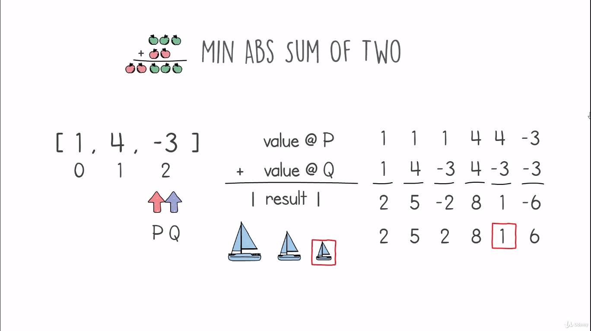
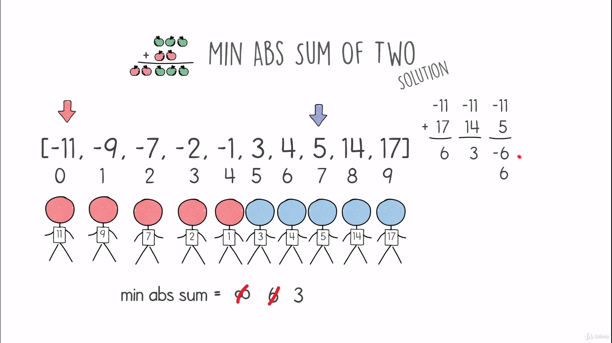

# Min Abs sum of Two Problem

## Definition
- We are given a list of negative or positive integers, We have to find two integers, p, and q where their sum abs result is at a minimum.
- Having the list [1,4.-3] will return a result p=4 and q=3 and the min abs sum is 1.
    <table>
        <tr>
            <td></td>
        </tr>
    </table>
- Our target is to find a solution with log-linear time complexity O(nlogn) and constant space complexity O(1).

## Hints
- Having an input of only positive numbers, the solution is to put p and q as the index of the lowest number of the list.
- Having an input of only negative numbers, it is easy here we put p and q as the index of the largest number of the list.
- Having an input that contains a value of zero, it is easy here we put p and q as the index of the zero number.
    <table>
        <tr>
            <td></td>
            <td></td>
            <td></td>
        </tr>
    </table>
- Represent the number of the list with different colors and remove the negative sign.
- Then choose the closest number of items.
    <table>
        <tr>
            <td></td>
            <td></td>
        </tr>
    </table>
- Sorting the list input will also help find the solution.

## Solution
- Put two pointers at the head and tail of the sorted list, and get their values and sum them together.
- Compare this result to the min_sum variable, and assign the result to it if the result is lower the variable is None.
- The next step is to move one of the pointers:
    - If the result obtained is positive, move the pointer at the larger number (head) forward.
    - If the result obtained is negative, move the pointer at the lower number (tail) backward.
- Keep processing until both pointers meat on the same numbers.
    <table>
        <tr>
            <td></td>
            <td></td>
        </tr>
        <tr>
            <td></td>
            <td></td>
        </tr>
        <tr>
            <td></td>
            <td></td>
        </tr>
        <tr>
            <td></td>
            <td></td>
        </tr>
        <tr>
            <td></td>
            <td></td>
        </tr>
        <tr>
            <td></td>
        </tr>
    </table>

## Code
    def solution(input):
        min_abs_sum = None
        input = sorted(input)
        head = 0
        tail = len(input) - 1
        while head <= tail:
            if not min_abs_sum:
                min_abs_sum = abs(input[head] + input[tail])
            else:
                min_abs_sum = min(min_abs_sum, abs(input[head] + input[tail]))
            if input[head] + input[tail] < 0:
                head += 1
            else:
                tail-= 1
        return min_abs_sum
