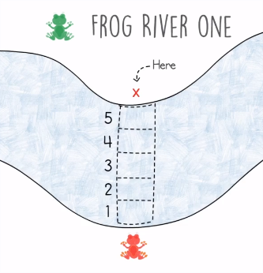
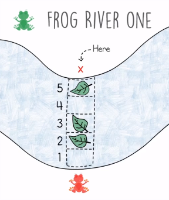
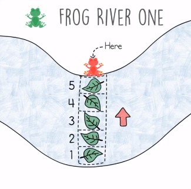

# Frog River One Problem

## Definition
- We have a frog on a side of a river and need to get to the other side.
- The frog should cross several virtual spaces to reach the other side of the river.
- Tree leaves are falling in these exact spaces and stay in that position.
- The frog can only get to a space that has a fallen leaf, when the leaves are all over the spaces, the frog can finally crosses the river.
- Here we have an example, a frog cross the river after the leaves fall on the 5 virtual spaces.
    <table>
        <tr>
            <td></td>
            <td></td>
            <td></td>
        </tr>
    </table>
- Given a variable x is the width of the, and an input list contain number represents where and when the leaves will fall.
- The time when a leaf fall is represented by the index, the value is when the leaf will falls.
- Our goal is to return the time (index) when the path of the frog is open.

## Hints
- Think about having a counter that counts the empty space in front of the frog.
- Initially, the counter will have the value of the width of the river.
- When a leaf falls in an empty space, we decrease the counter by 1.
- We should be aware when a leaf fall to a space that already has a leaf, we shouldn't decrease the counter.

## Solution
- Besides the counter, we can use a lookup array.
- We initialize the array of size of the river's width having **False** as values.
- The index of this lookup table represents the spaces between the riverside.
- When a leaf falls at a position, we set it to True if it is False and we decrease the counter.

## Code
    def solution(input, x):
        # NOTE the values of the input list starts by one
        # # so we initialize the lookup array starting by 1 and ending by x+1
        river_positions = [False] * (x+1)
        for time in range(len(input)):
            pos = input[time]
            if not river_positions[pos]:
                river_positions[pos] = True
                x -= 1
                if x == 0: return time

        return -1
