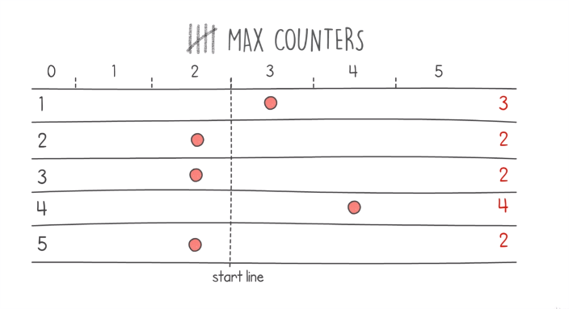

# Max Counters Problem


## Definition
- This problem has 2 inputs, the number of counters, and a list representing a list of instructions to perform on those counters.
- example, we have 5 counters and a list [3,3,4,6,1,4,4]
    - Initially, the counters values are zeros.
    - Instruction received are 2 types, either increase counter values or a **max counter**.
    - Reaching a value that is greater than the number of counters, is the max counter instruction
    - When we have a max counter instruction, we reset all counters values to be the value of our maximum counter.
    - Once the instructions are done, we return the list of counters values results [3,2,2,4,2].
    <table>
        <tr>
            <td></td>
            <td></td>
            <td></td>
        </tr>
    </table>
- Our target is to find a solution with linear time complexity O(n+m) *(where m is the length of the instructions list)* and linear space complexity O(n).


## Hints
- To the counters element to the current maximum value, means to iterate all over the counters list, which turns our algorithm quadratic.
- To solve this issue, think that we have a virtual race.
- The counters are placed on a virtual race track, their moving forward depends on their values.
- When we have a max counter instruction, we move the starting line to the front of our fastest runner, instead of moving all counters forward, it is like start the race over again.
    <table>
        <tr>
            <td></td>
            <td></td>
            <td></td>
        </tr>
    </table>


## Solution
- What happens here is when we have an increase instruction for a counter that is behind the starting line, we move to the front of the starting line, and if it is after the starting line, we move it only one position.
- Once we complete our operations, some of our counters might be still behind the starting line.
- Our final step is to move them to the starting line.
    <table>
        <tr>
            <td></td>
            <td></td>
        </tr>
    </table>

## Code
- steps in the solution
    <table>
        <tr>
            <td></td>
        </tr>
    </table>
    
    ```
    def solution(input, n):
        counters = [0] * n
        start_line = 0
        current_max = 0

        for i in input:
            x = i-1
            if i > n:
                start_line = current_max
            elif counters[x] < start_line:
                counters[x] = start_line + 1
            else:
                counters[x] += 1
            if i <= n and counters[x] > current_max:
                current_max = counters[x]

        for i in range(0, len(counters)):
            if counters[i] < start_line:
                counters[i] = start_line
        
        return counters
    ```