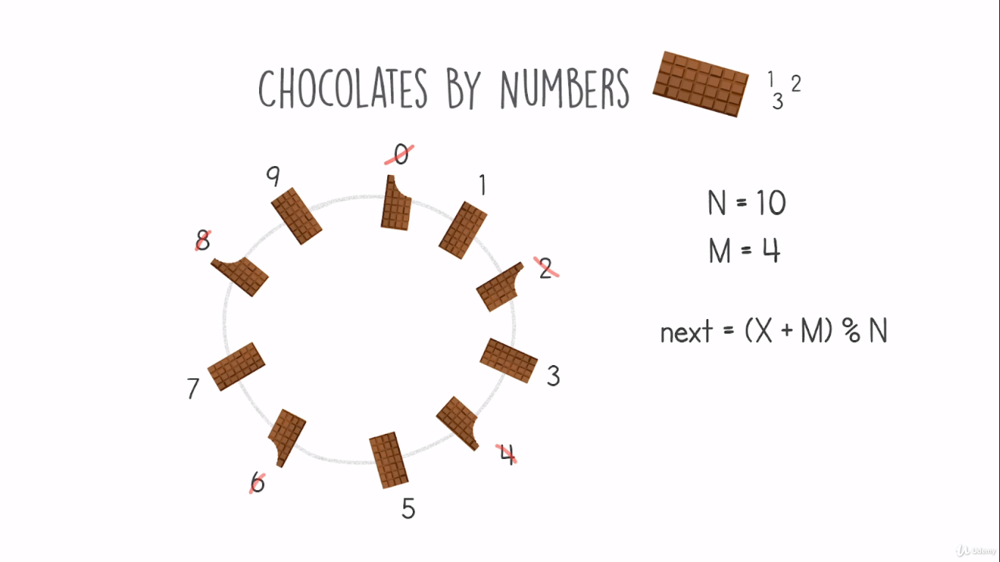
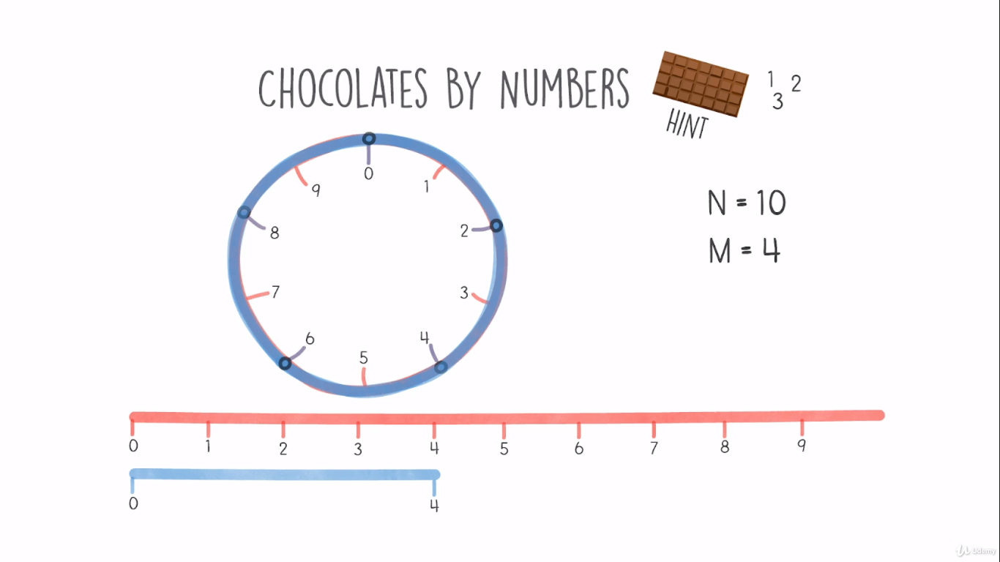
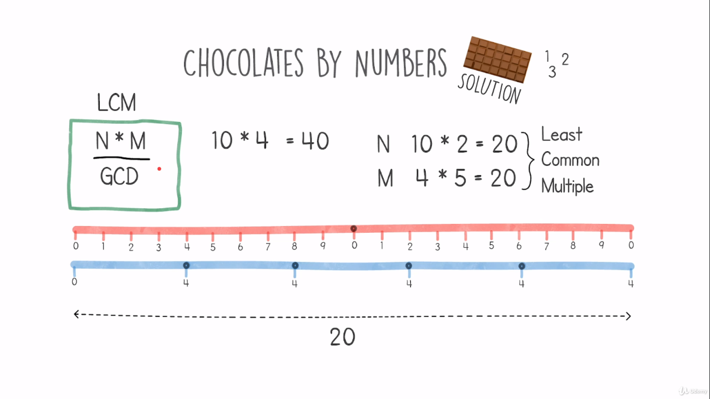
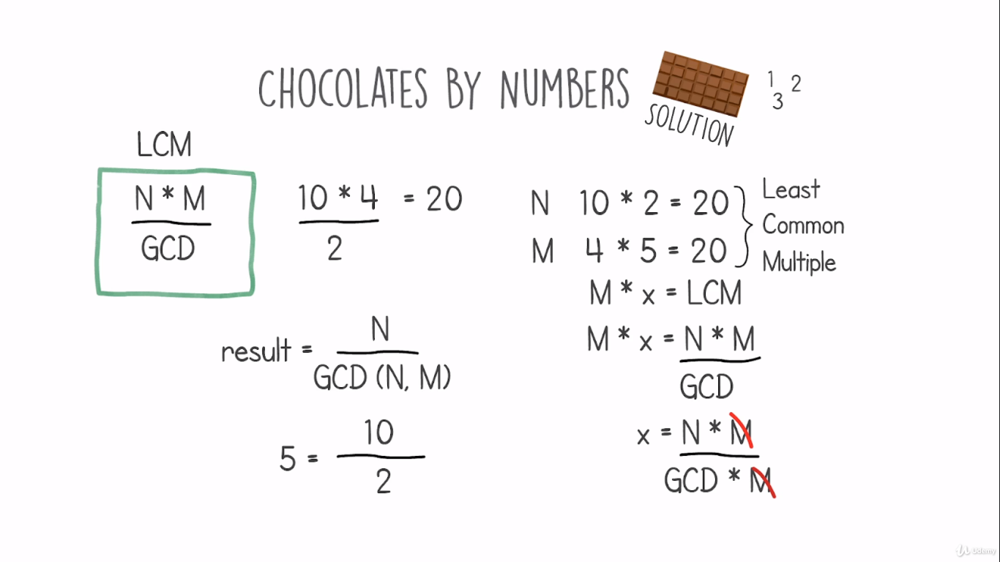

# Chocolates By Numbers Problem

## Definition
- We have several chocolates arranged circularly, and there is a manner in which we can eat these chocolates.
- The chocolates are represented by a sequence of numbers starting by zero.
- How we can eat these chocolates is an integer.
- We start to eat the chocolate in pos zero, then we jump manner positions for the next chocolate to eat.
- After finishing the full cycle and encounter chocolate that has been eaten we stop, and we return the number of chocolates eaten.
- In the example below we have the number of chocolates n=10, manner m=5.
    - To jump to the second chocolate to eat we use the formula next = (pos + m) / n.
    <table>
        <tr>
            <td></td>
        </tr>
    </table>
- Our target is to find a solution with logarithmic time complexity O(log(n+m)).

## Hints
- Let's imagine a line divided into n equal parts, and a circle having the same parts.
- And let's imagine several strings of length m, and we want to cover the circle with them.
- Each time we glue the strings next to each other.
    <table>
        <tr>
            <td></td>
        </tr>
    </table>

## Solution
- This time use the lines, and extend the blue line.
- continue extending until the 2 lines red and blue match each ohers length.\
- The resulted length is a common multiple of n and m, and also it is the least common multiple (LCM)
- The LCM is m * the result that should be returned --> m * result = LCM --> m * ressult = n * m / GCD
- GCD = n * m / LCM
- result = n * m / GCD * M --> result = n / GCD
    <table>
        <tr>
            <td></td>
            <td></td>
        </tr>
    </table>

## Code
    def find_gcd(a,b):
        if b == 0:
            return a
        else:
            return find_gcd(b, a%b)

    def solution(n, m):
        return n // find_gcd(n,m)
