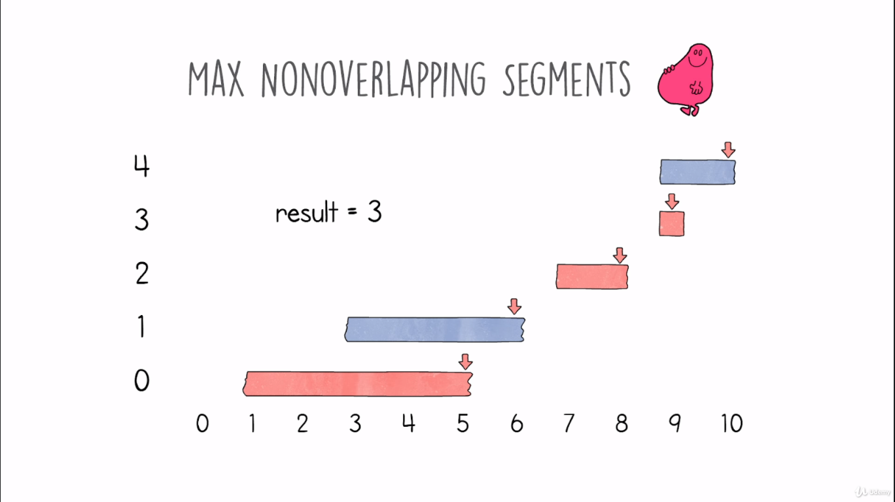
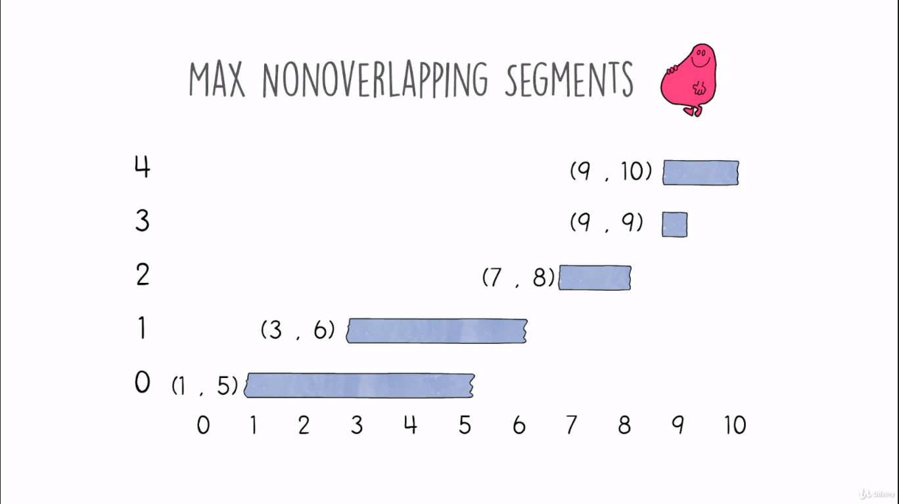
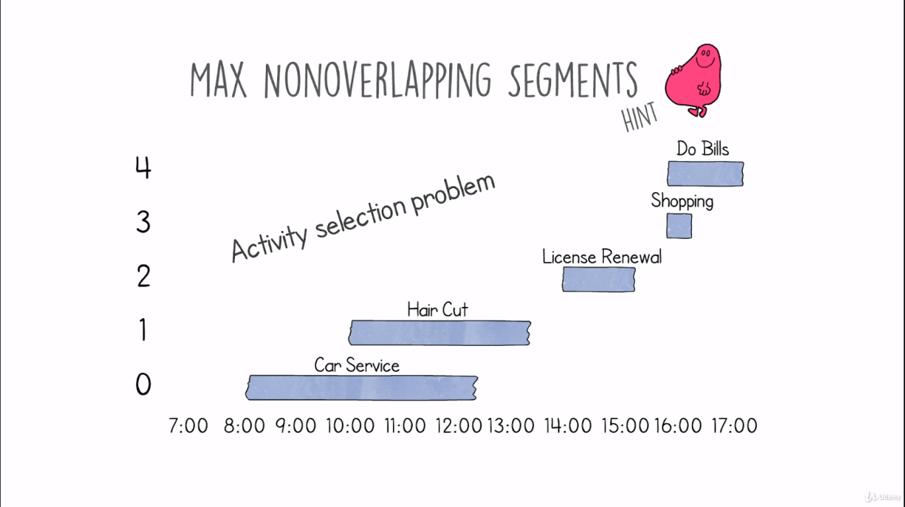
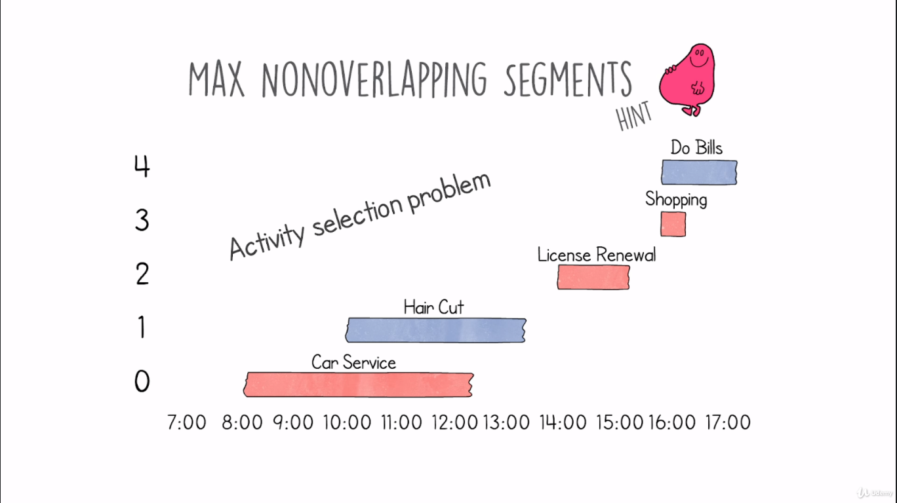
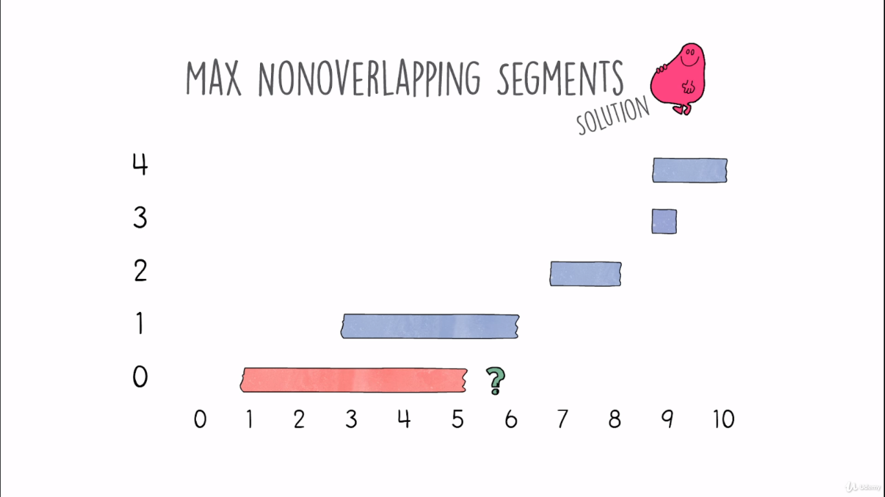
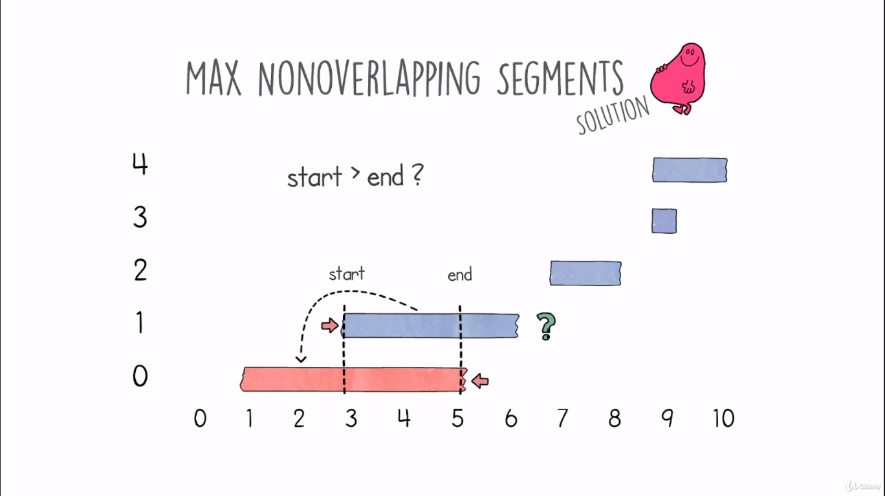
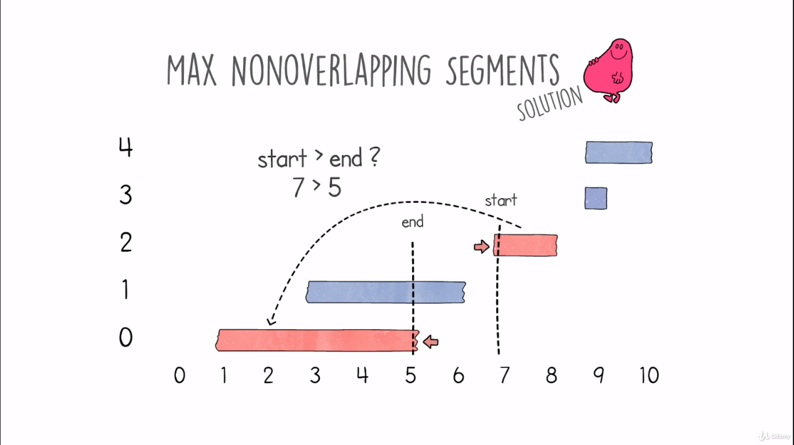
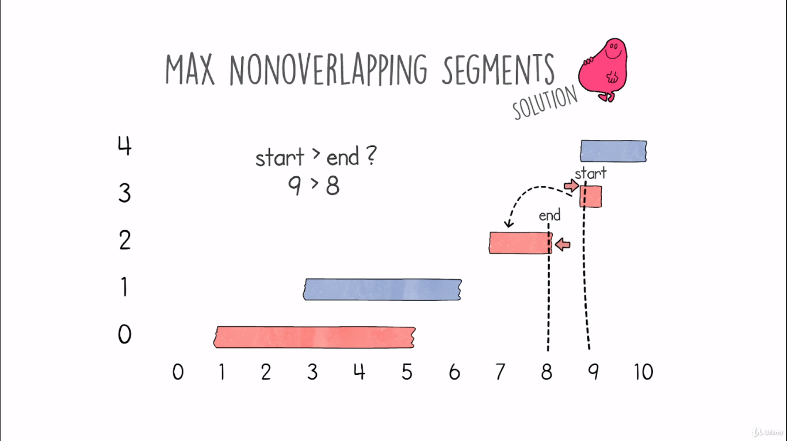

# Max Nonoverlapping Segments Problem

## Definition
- We are given several segments, we need to find the number of segments that do not overlap another one.
- The segments are ordered by the ending position, so if the beginning of one segment is behind the ending of another one, we have an overlapping.
- The input of this problem is a list of tuples, where the first element is the start of the segment and the second one is the end.
    <table>
        <tr>
            <td></td>
            <td></td>
        </tr>
    </table>
- Our target is to find a solution with linear time complexity O(n).

## Hints
- This problem is the same as the activity selection problem, instead of segments we have tasks.
- What we should do is select the tasks that do not overlap each other.
- The solution is not unique, you can choose an overlapped task and do not overlap other tasks.
    <table>
        <tr>
            <td></td>
            <td></td>
        </tr>
    </table>

## Solution
- Start with the first segment.
- Move forward to the next and check if there is overlapping.
- If we have multiple non overlapped segments, and we reach a new one, it is sufficient to check with the latest closest non overlapped segment if there is any overlapping. 
    <table>
        <tr>
            <td></td>
            <td></td>
        </tr>
        <tr>
            <td></td>
            <td></td>
        </tr>
    </table>

## Code
    def solution(input):
        last_end_segment = -1
        chosen_count = 0
        for i in range(len(input)):
            start, end = input[i]
            if start > last_end_segment:
                last_end_segment = end
                chosen_count += 1
        return chosen_count