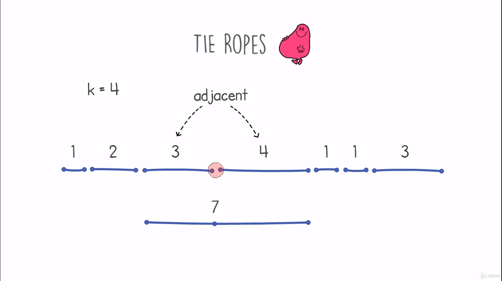
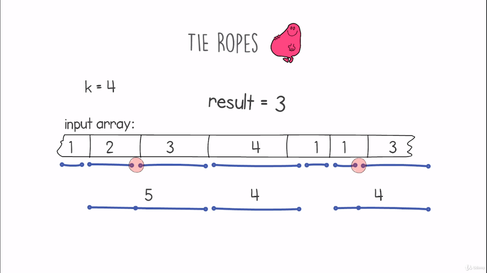
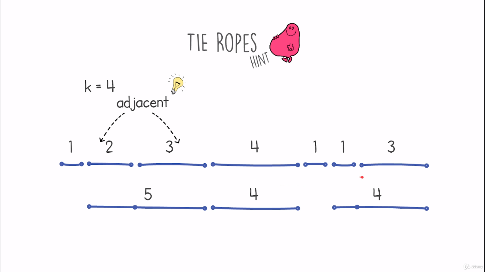
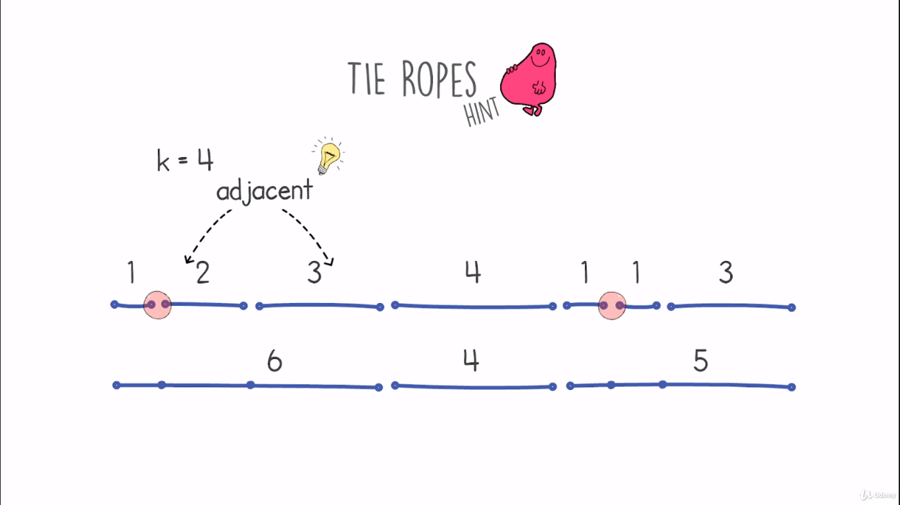
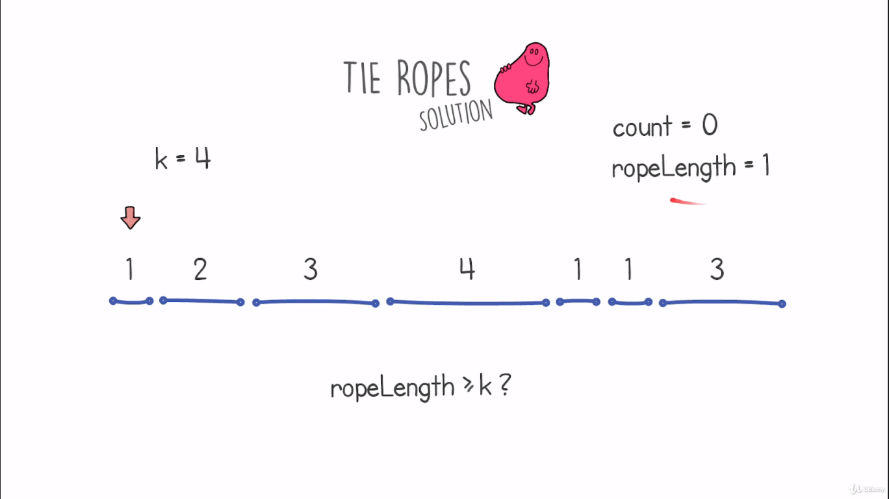
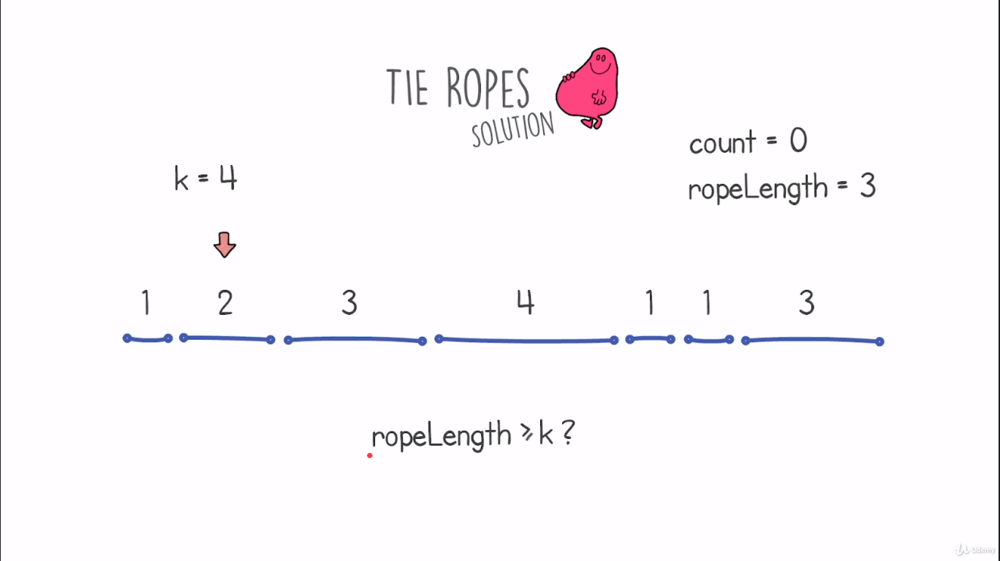
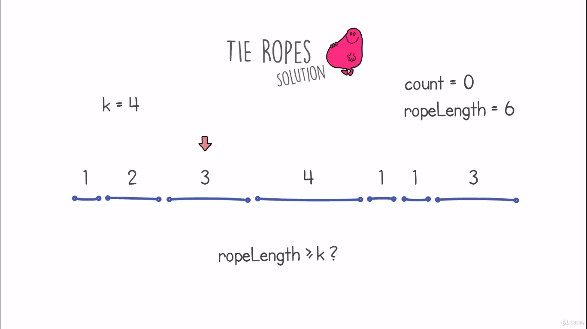
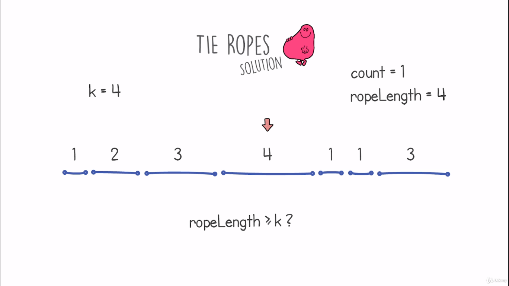
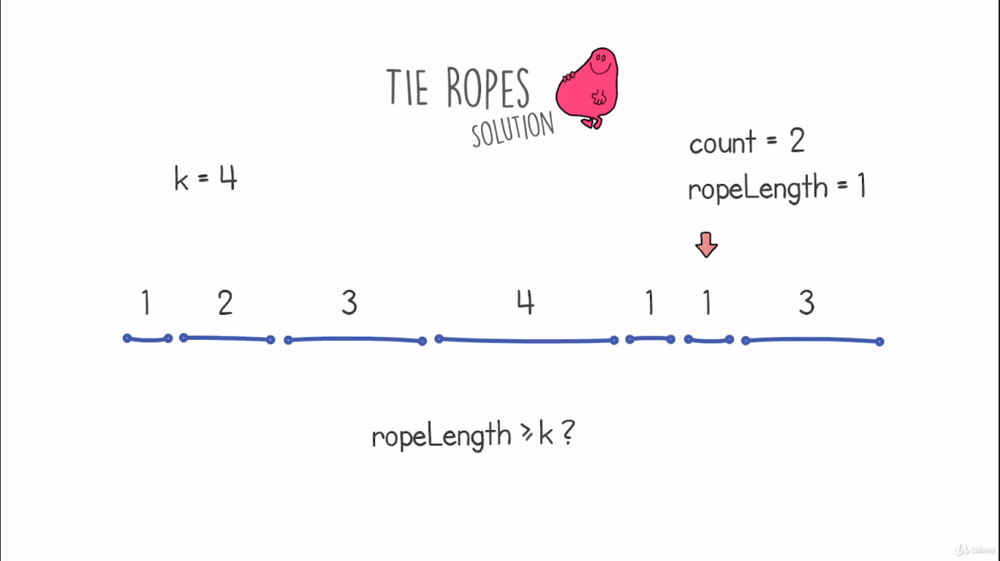
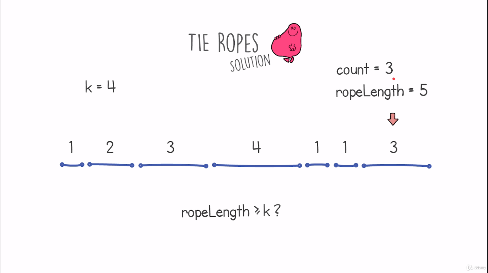

# Tie Ropes Problem

## Definition
- We are given several ropes of different lengths and a constant k.
- We can tie ropes to each other only if the ropes are adjacent.
- The length of the tied ropes is their length sum.
- This problem aims to return the maximum number of ropes of which if we tie them together will have a length >= k.
    <table>
        <tr>
            <td></td>
            <td></td>
        </tr>
    </table>
- Our target is to find a solution with linear time complexity O(n).

## Hints
- Tie only adjacent ropes makes the solution easier.
- Including other non tied ropes after we found our maximum result, will not affect this result.
    <table>
        <tr>
            <td></td>
        </tr>
    </table>

## Solution
- Start from the first rope and start to add reached ropes' length, if their length sum is >= k, we reset the sum and we increment the count of ropes by 1.
    <table>
        <tr>
            <td></td>
            <td></td>
        </tr>
         <tr>
            <td></td>
            <td></td>
        </tr>
         <tr>
            <td></td>
            <td></td>
        </tr>
         <tr>
            <td></td>
        </tr>
    </table>
    

## Code
    def solution(k, input):
        count = 0
        tied_rope_length = 0
        for rope in input:
            tied_rope_length += rope
            if tied_rope_length >= k:
                count += 1
                tied_rope_length = 0
        return count