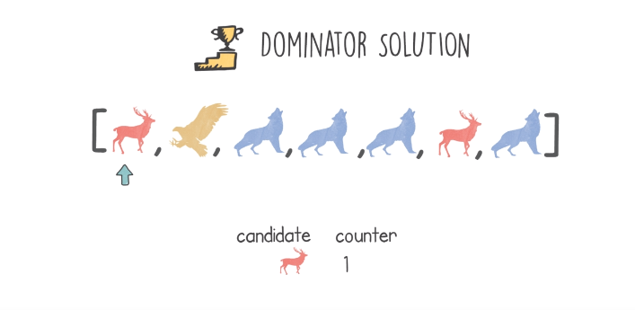
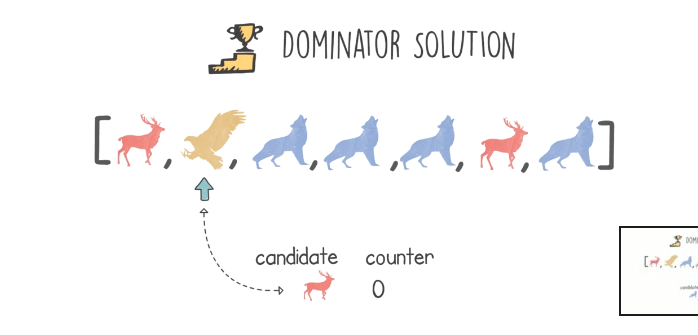
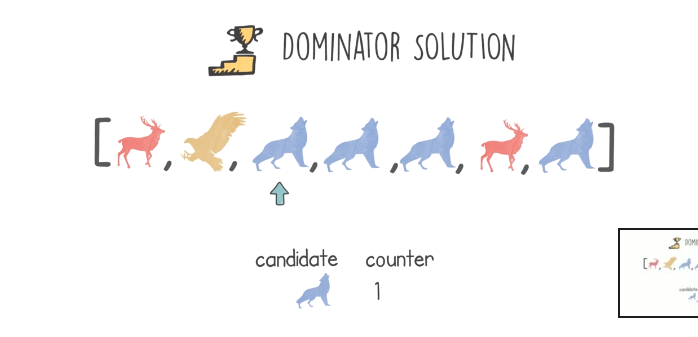
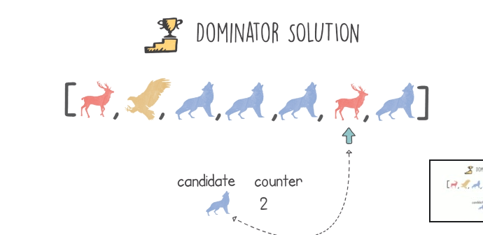
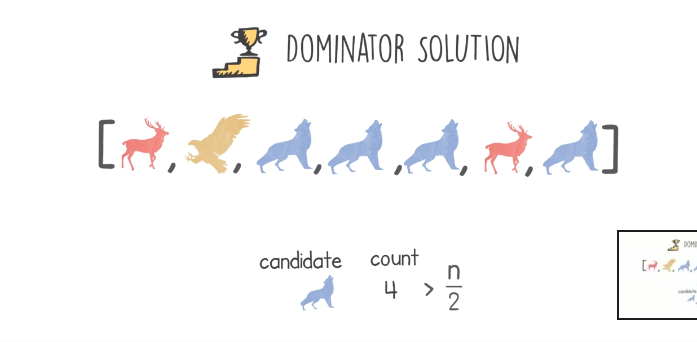

# Dominator Problem

## Definition
- The leader in a list is an item that has a particular property
- For example, find the leader in the list **[2,4,3,3,3,2,3]** where the leader is the item that occurred more than half of the list, the leader is 3
- Using brute force, we have will have an algorithm that has a quadratic runtime complexity.
- Sorting the list will make the algorithm faster having log-linear runtime complexity.
- Our target is to find a solution with linear time complexity O(n) and constant space complexity O(1).

## Hints
- If two different items are next to each other removed, the result list will have the same leader
- Keep doing this until we have a list of one or two similar items which will be the leader.

## Solution
- How to remove adjacent items from a list? => using a stack.
- Starting iterating the items in the list, push items when the stack is empty or the current item is equal to the item poped, and pop and eliminates item when they don't match
- In the end, the remaining item can be the leader, we can verify this by counting the occurrences in the list.
- This method has a linear space complexity O(n).
- We dump the stack and we use a candidate value.
- When we reach every element in the list, we take it as a candidate and we give a value of 1.
- Moving through the items, if the next item is different we decrement the candidate value by 1, else we increment by 1.
- If the candidate is zero, and we encounter a diff item, we take it as a candidate.
    <table>
        <tr>
            <td></td>
            <td></td>
            <td></td>
        </tr>
    </table>
    <table>
        <tr>
            <td></td>
            <td></td>
        </tr>
    </table>

## Code
    def solution(input):
        candidate_counter = 0
        candidate = 0
        for i in input:
            if candidate_counter == 0:
                candidate = i
                candidate_counter = 1
            elif candidate == i:
                candidate_counter += 1
            else:
                candidate_counter -= 1
        
        if candidate:
            occurences = input.count(candidate)
            if occurences >= len(input)/2:
                return input.index(candidate)
        return -1