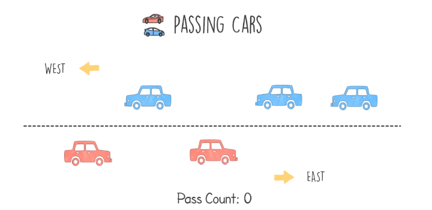
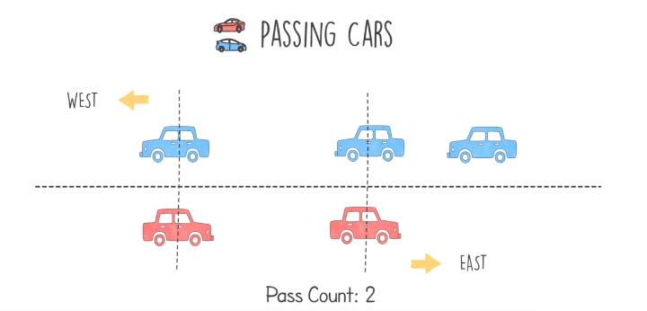
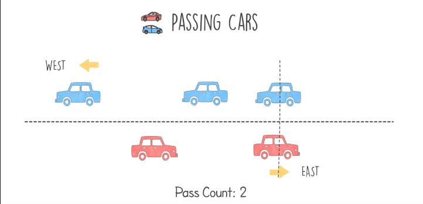
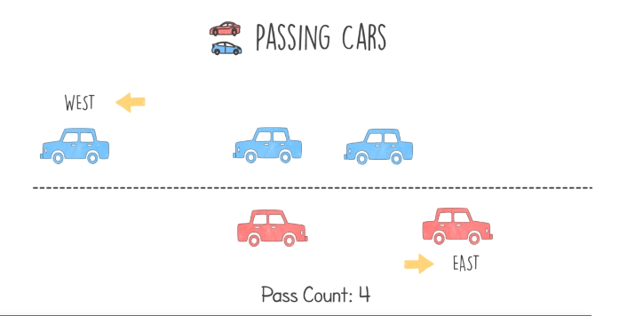
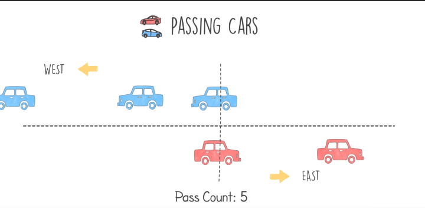

# Passing Cars Problem

## Definition
- We have a road with two ways, each way has the passing car on it.
- The aim of the problem is the count opposites facing cars pass each other.
- The cars that are going west have the number of 1, the ones that are going east have the number of zero.
- In the example below, we have 5 cars, where the index is the starting position of each car.
- The input will look like [0,1,0,1,1].
    <table>
        <tr>
            <td></td>
            <td></td>
            <td></td>
        </tr>
    </table>
    <table>
        <tr>
            <td width="200"></td>
            <td></td>
            <td></td>
            <td width="200"></td>
        </tr>
    </table>
- Our target is to find a solution with linear time complexity O(n) and linear space complexity O(n).

## Hints
- We have to count the number of opposite cars that are ahead of a given car (by index and direction)
- We can take the car that is going to the west or east, both methods will return the same result.

## Solution
- Using the prefix sum array will help solving the problem
- For input [0,1,0,1,1], the prefix sum list if [0,0,1,1,2,3]
- We have the zeros the cars that are going to the east
    - 0 and 2 are the index
    - For and element at a given position, to count the elemnts that are ahead, we substract the final element in the prefix sum array from the element at position + 1 in the same array also
    - For car at position 0, we calculate 3 - prefix_sum_arr[1] = 3 - 0 = 3
    - For car at position 2, we calculate 3 - prefix_sum_arr[3] = 3 - 1 = 2
    - The total result is 5 which is the correct answer

## Code
    def solution(input):
        prefix_sum = [0] * (len(input) + 1)
        # NOTE calculate the prefix ssum
        for i in range(len(input)):
            prefix_sum[i+1] = prefix_sum[i] + input[i]
        
        count = 0
        for i in range(len(input)):
            if input[i] == 0:
                count += (prefix_sum[len(input)] - prefix_sum[i+1])

        return count