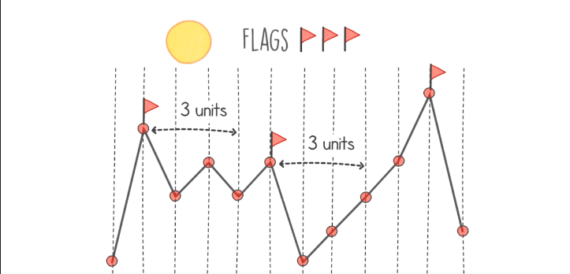

# Flags Problem

## Definition
- This problem deals with mountains, the given input represents different heights and different points on the mountain range.
- The aim is the find the peaks (summits) of these mountains and put flags on top of them.
- The distance between the points is equal horizontally.
- Also, there should be a minimum space between flags.
- We should return the number of peaks that we can place the flag on by respecting the distance rule.
- In this example, we have to find the number of peaks where we can place our flags, and each flag is separate from the other by 3 points at least.
    <table>
        <tr>
            <td></td>
        </tr>
    </table>
- The of spaces is the same number of flags.
- We can tell a point a peak when it has a high value than its neighbor.
- Our target is to find a solution with linear time complexity O(n) and linear space complexity O(n).

## Hints
- We have realized that there are 2 parts to solve this problem:
    - Pre-process the peaks.
    - Find max number of flags that can be placed.
- Starting by the second part makes sense, if we have 5 flags to place, we need at least 20 (5^2 - 5) points in the mountain range
- For the first part, simply our input so it can contain only values of 0 and 1, 1 for the peaks, and 0 for non-peak points.

## Solution
- Having this input [1,5,3,4,3,4,1,2,3,4,6,2], We start by pre-processing the peaks.
    - We initialize an empty array of the same size and put the size as the last item of this new array => [..., 12].
    - We start iterating from the last item of our input by setting the value of 12, once we reach a peak, we reset the value as the index of that peak in the input array.
        - by reaching 6, which is a peak, we set the value as 10 => [..., 10, 12].
    - Continue to the next peak, 4 at index 5 => [..., 5, 10, 10, 10, 10, 10, 12].
    - Continue to the next peak, 4 at index 3 => [..., 3, 5, 5, 10, 10, 10, 10, 10, 12].
    - Continue to the next peak, 5 at index 1 => [1, 1, 3, 3, 5, 5, 10, 10, 10, 10, 10, 12].
- This will make the second part easier, by creating a function that accept the pre-processed array and the number of flags as parameters.
    - This function will return if is it True or false if we can place this number of flags on this mountain range or not.
    - How to call this function with a different number of flags? => simply we start from 1 to the upper limit square_root(n) + 2
    - We will start by 1 until the last correct value which is 4.
    - We can conclude that we cannot put 5 flags distanced 5 points from each other.

## Code
    def solution(input):
        peaks = [0] * len(input)
        next_peak = len(input)
        peaks[len(input)-1] = next_peak
        for i in range(len(input)-2, 0, -1):
            if input[i-1] < input[i] and input[i+1] < input[i]:
                next_peak = i
            peaks[i] = next_peak
        peaks[0] = next_peak

        current_guess = 0
        next_guess = 0
        while can_place_flags(peaks, next_guess):
            current_guess = next_guess
            next_guess += 1
        return current_guess

    def can_place_flags(peaks, flags):
        current_pos = 1 - flags
        for i in range(flags):
            if current_pos + flags > len(peaks) - 1:
                return False
            current_pos = peaks[current_pos+flags]
        return current_pos < len(peaks)