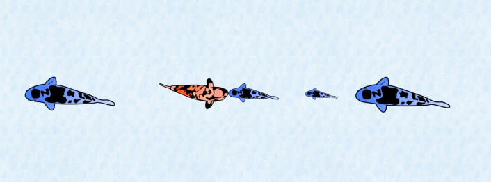
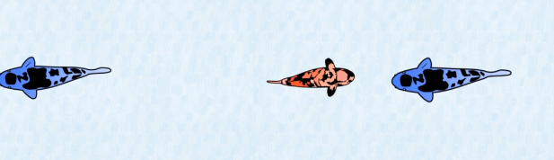
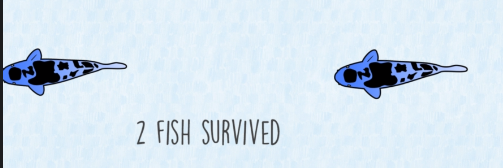

# Voracious Fish Problem

## Definition
- We have several hungry fish in a river, where some of them are swimming in a direction while the others are swimming in the opposite direction.
- None of these fishes have the same size, and the rule is when two fishes are swimming in opposite directions encounter each other, the bigger one will eat the smaller ones.
- This problem aims to find out how many fish will survive in the end
- In the example here we have 5 swimming fish, and the color blue and orange determine the swimming direction:
    - The bluefish on the left will survive automatically because it didn't encounter any fish
    - The orange fish will encounter the first and second blue fishes and eat them because their weight is smaller.
    - The orange fish will encounter the last blue that has a bigger weight, so the bluefish will eat the orange fish
    - As result, we have 2 blue fishes that have survived
    <table>
        <tr>
            <td></td>
            <td></td>
            <td></td>
        </tr>
    </table>
- In the problem, we have 2 inputs, a list with only 0 and 1 values that determine the direction of swimming, and a second list same size determine the weight of the swimming fish
- Our target is to find a solution with linear time complexity O(n) and linear space complexity O(n).

## Hints
- Use Stacks to solve the problem

## Solution
- Store the fishes that swim into the right
- Pop a fish when an opposite direction fish is encountered and compare the fish's weight.
- When we have a fish and the stack is empty, we increment the survivors counter.
- In the end, we add the number of fish in the stack (if exist) to the survivors' counter.

## Code
    def solution(directions, weights):
        stack = []
        survivors = 0
        for i in range(len(directions)):
            weight = weights[i]
            if directions[i] == 1:
                stack.append(weight)
            else:
                weight_down = stack.pop() if stack else -1
                while weight_down != -1 and weight_down < weight:
                    weight_down = stack.pop() if stack else -1
                if weight_down == -1:
                    survivors += 1
                else:
                    stack.append(weight_down)

        return survivors + len(stack)

