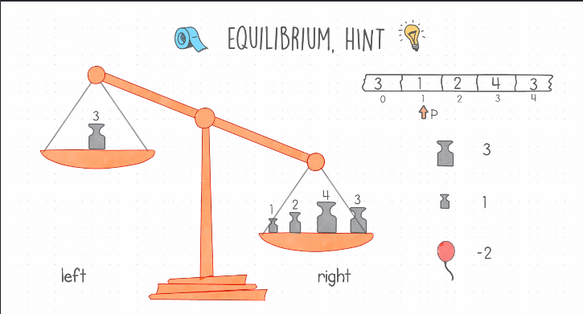
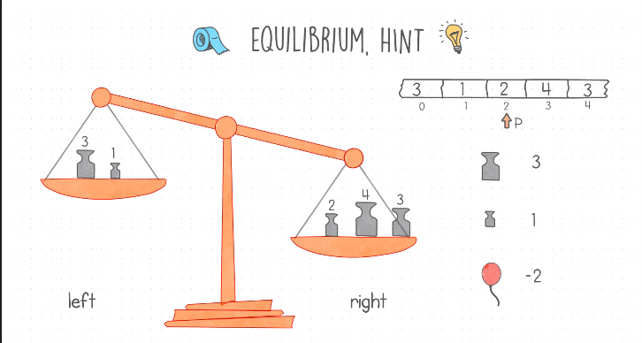
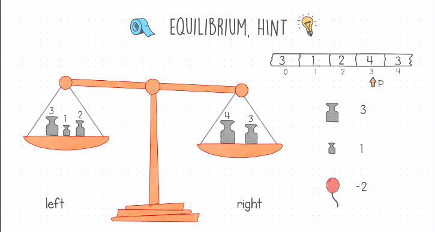
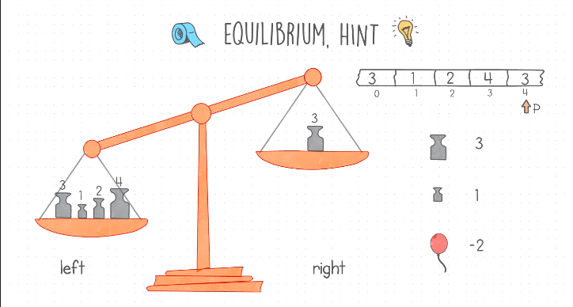

# Equilibrium Problem

## Definition
- Given a list of numbers, the equilibrium of this list is the position (pivot) of the index that divides the list into two-part, left and right(including the pivot) parts, where the absolute difference between these parts is at its minimum.
- Having this input list as an example
    ```
    input = [3,1,2,4,3]
    ```
  let's place the pivot at each index and calculte the absolute difference
    - p=0 ==> None
    - p=1, left = [3] and right = [1,2,4,3] ==> sum_left=3 and sum_right=10 ==> |3-10|=7
    - p=2, left = [3,1] and right = [2,4,3] ==> sum_left=4 and sum_right=9 ==> |4-9|=5
    - p=3, left = [3,1,2] and right = [4,3] ==> sum_left=6 and sum_right=7 ==> |6-7|=1
    - p=4, left = [3,1,2,4] and right = [3] ==> sum_left=10 and sum_right=3 ==> |10-3|=7
  p=3 is the result of our example
- Our target is to find a solution with linear time complexity O(n) and constant space complexity O(1).

## Hints
- Iterate over each item, and the left and right part divided where at index p where p > 0, then calculate the difference of the sum of each part numbers.
    ```
    diff = 0
    p = 0
    for i in range(1, len(input)):
        sum_left = 0
        sum_right = 0
        for j in range(0, i-1):
            sum_left += input[j]
        for j in range (i, len(input)):
            sum_right += input[j]
        current_diff = abs(sum_left - sum_right)
        if i == 1:
            diff = current_diff
        elif current_diff < diff:
            diff = current_diff
            p = i
        print(sum_left, sum_right, i, p)
        
    return p
    ```
    this solution has a quadratic O(n^2).
- Think about solving this problem using scales, at index p=1, put the left part number on the left scale and the rest right part number on the right scale.
  Moving the pivot forward, remove one number from the right scale and add it to the left scale, keep doing this until you have the minimum difference.
  <table>
    <tr>
        <td></td>
        <td></td>
    </tr>
    <tr>
        <td></td>
        <td></td>
    </tr>
  </table>
  

## Solution
- The first step of our solution is to place the pivot at index 1 and calculate the sum of the left and right parts
- Calculate the absolute difference between the sums of left and right parts.
- Moving the pivot forward, add the element at index pivot to the sum of the left part and subtract it from the right side.
- Calculate the new absolute difference, and compare it with the old one and keep the minimum and its index.
- After iterating over all items, the kept index is the equilibrium.

## Code
    def solution(input):
        sum_left = input[0]
        sum_right = sum(input) - input[0]
        diff = abs(sum_left - sum_right)
        p=1
        for i in range(1, len(input)):
            sum_left += input[i]
            sum_right -= input[i]
            current_diff = abs(sum_left - sum_right)
            if current_diff < diff:
                diff = current_diff
                # NOTE i should in included in the right part
                p = i+1
        return p